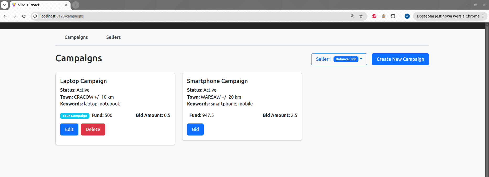

# Project Setup

## Backend

### Running the Backend
To run the backend, open the file `src/main/java/com/example/campaignmanagement/CampaignManagementApplication.java` and click `Run` or set up a Maven task `spring-boot:run` in the root directory of the project


## Frontend
### To run the frontend,
navigate to the frontend directory `/frontend` and execute the following command:
```bash
npm run dev
```
